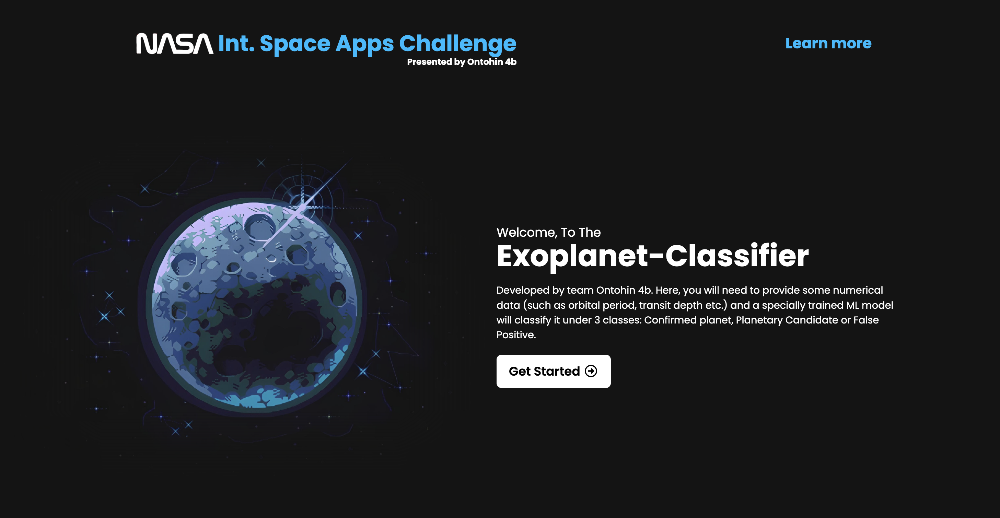
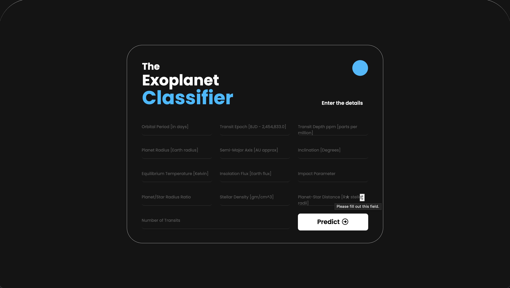
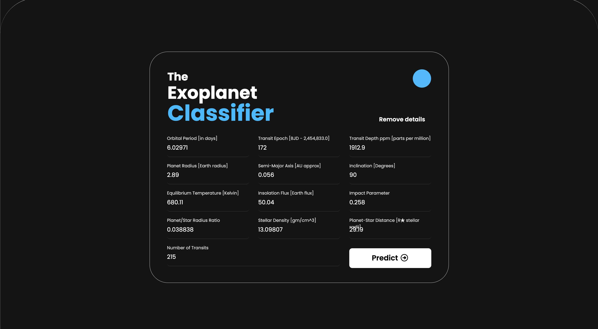
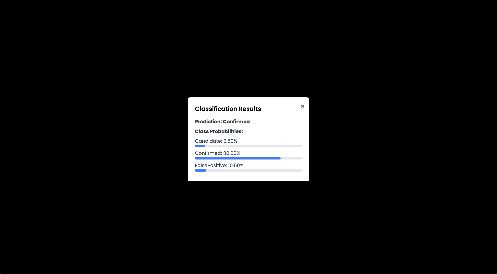
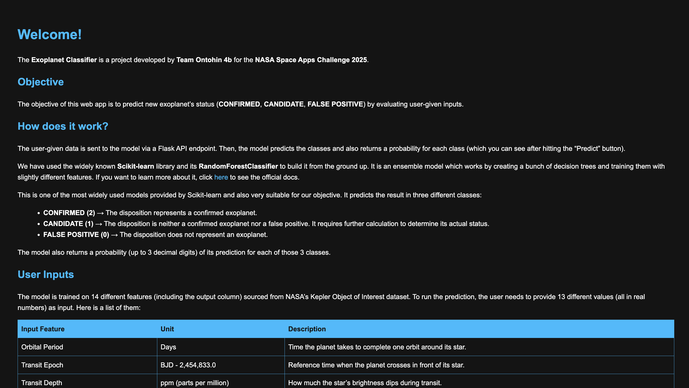

  
# The Exoplanet Classifier 🪐
  
A simple yet effective web-based Machine Learning tool that predicts whether a given set of transit data corresponds to a genuine exoplanet, a false positive, or an unclassified candidate. We combined sheer ML performance with a clean and gorgeous frontend UI that lets users explore exoplanets without any technical expertise.

---

  

  

## Table of Contents

- [The Exoplanet Classifier 🪐](#the-exoplanet-classifier-)
  - [Table of Contents](#table-of-contents)
  - [Project Overview](#project-overview)
  - [Tech Stack](#tech-stack)
  - [Getting Started](#getting-started)
  - [How to Use](#how-to-use)
  - [Model Details](#model-details)
  - [Results](#results)
  - [Screenshots](#screenshots)
  - [Acknowledgements](#acknowledgements)
  - [Appreciation](#appreciation)

---

## Project Overview

NASA's various exoplanet survey missions have identified thousands of transit data points through **the transit method**. After extensive research, these data points are further classified into confirmed planets, false positives or planetary candidate. The data from this missions are open source and provided by NASA (National Aeronautics and Space Administration). **Our objective** was to create an AI model trained on these data which can help scientists to conduct preliminary prediction on the data to find out it's possibilities.


The ML model serves as a website which is developed with proper frontend, backend and Flask web framework to act as the bridge. Users have to provide some transit data as input and then the model will predict it's class. The intuitive UI is extremely helpful for those who doesn't have deep understanding of tech.
  

---

## Tech Stack
  

-  **Python 3.11 or above** – Core programming language

  

-  **Pandas** – Data handling and preprocessing

  

-  **Scikit-learn** – Random Forest Classifier modeling, Standardization, Imputation, Cross Validation and many more

  

-  **Flask** – Web framework for front-end interface

  

-  **HTML/CSS** – User-friendly web interface

  

-  **JavaScript** - For connecting the frontend with the backend (Python Flask)

  

-  **Jupyter Notebook** - Used for testing ML code before writing the final version. Not included in the final repository.


---


## Getting Started

  

  

1.  **Clone the repository**

  

```bash

  

git  clone  https://github.com/Ontohin-4b/The_Exoplanet_Classifier/

  

cd  "The_Exoplanet_Classifier"

  

```

  

  

2.  **Install dependencies**

  

```bash

  

pip  install  -r  requirements.txt

  

```

  

  

3.  **Train the model (only once)**

  

```bash

  

python  model/rfc_fit.py

  

```

  

  

1.  **Run the Flask framework**

  

  

```bash

  

python  app.py

  

```

  

  

5. Open your browser and go to `http://127.0.0.1:5000` to access the web interface.

  

  

6. If you want to close the server, press `Ctrl + C` in the terminal where you have run `app.py` from.

  

  

---

  

  

## How to Use

  

  

- Press **Get Started** on the webpage.

  

  

- Enter the candidate features in the input fields (values like Orbital Period, Transit Epoch, Transit Depth, etc.).

  

- Click **Predict** to run the prediction.

  

- For more detailed information about each input and other subjects, press **LEARN MORE** (located at the top).

  

  

---

  

  

## Model Details

  

  

-  **Algorithm:** Random Forest Classifier

  

-  **Number of decision trees (`n_estimators`):** 1000

  

-  **Tree Depth:** None

  

-  **Training Datasets:** [Kepler Objects of Interest](https://exoplanetarchive.ipac.caltech.edu/cgi-bin/TblView/nph-tblView?app=ExoTbls&config=cumulative), [K2 Planets and Candidates](https://exoplanetarchive.ipac.caltech.edu/cgi-bin/TblView/nph-tblView?app=ExoTbls&config=k2pandc)

  

-  **Features:** 13 feature columns were used. Most of them are orbit and transit related features.

  

The model was trained to balance accuracy with generalization, ensuring predictions are reliable even for unseen candidates.

  

  

---

  

  

## Results

  

  

Check [model/rfc_fit.py](https://github.com/Ontohin-4b/The_Exoplanet_Classifier/blob/main/model/rfc_fit.py) to see the classification report and [model/rfc_cross_val.py](https://github.com/Ontohin-4b/The_Exoplanet_Classifier/blob/main/model/rfc_cross_val.py) to see cross-validation results.

  
---
  

## Screenshots
**Landing Page**

**Input Fields**

**Input Fields when filled**

**Output**

**About Page**


  

---

  

  

## Acknowledgements

  

  

- NASA Kepler and K2 Mission for providing the training datasets

  

- Scikit-learn and Flask communities for excellent documentation and tutorials

  

- Inspiration from data science projects exploring real-world astrophysics datasets

  

- The scientists who are engaged with exoplanet research. Their problem inspired us to create this project from the ground up.

---  

## Appreciation

Thank you for giving our work a look. We hope we were able to satisfy the needs and problems of real researchers even in the tiniest amount.

  

**Have a great day !**
